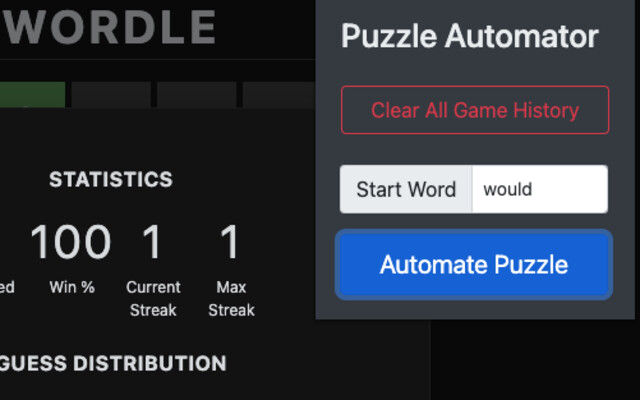

# Wordle Automator
Solve Wordle with an algorithm.  

[Go here](https://browser.google.com/webstore/detail/wordle-solver-can-you-bea/cobhbmncjhlgmfndhdloojjojcnbmlic) to get the Chrome Extension.  

The word list used is sorted by frequency and from [aspell.net's Google Books corpus data](http://app.aspell.net/lookup-freq).

Additional sorts occur, such as letter frequency, if the number of turns that have passed are still few.

User customization of the algorithm through the extension will likely be added in the future.

This is an unofficial extension.

## Thank You
Icon from [popo2021 on flaticon.com](https://www.flaticon.com/free-icon/letter-w_7312338) (free for personal and commercial purpose with attribution)

